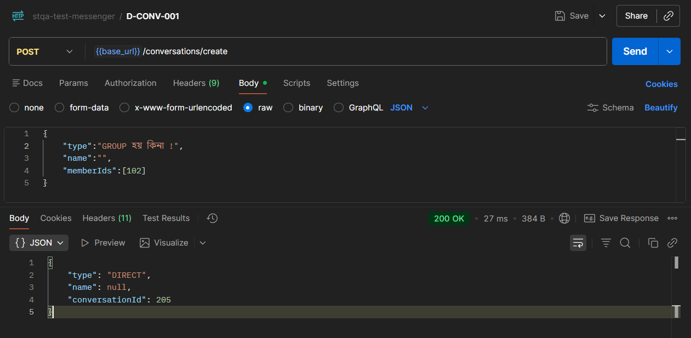

## PART 1: AUTH APIs

## PART 2: USER APIs

## PART 3: CONVERSATION APIs

### D-CONV-001: Create GROUP with invalid type

- **Test-Case:** TC-CONV-004
- **Severity:** -
- **Pre-conditions:** Users alice (101), bob (102) exist and they already have Direct messaging, alice logged in
- **Steps:**
  1. POST /conversations/create
  2. Header: `Authorization: Bearer <alice_token>`
  3. Body: `{"type":"GROUP হয় কিনা !","name":"","memberIds":[102]}`
- **Expected:** 400 Bad Request
- **Actual:** 200 OK, returns `{
    "type": "DIRECT",
    "name": null,
    "conversationId": 205
}`
- **Evidence:** 

### D-CONV-002: Create GROUP with Empty Name

- **Test-Case:** TC-CONV-004
- **Severity:** This is a huge security breach! Anyone can create a group with no name with anyone!
- **Pre-conditions:** Users alice (101), bob (102) exist, alice logged in
- **Steps:**
  1. POST /conversations/create
  2. Header: `Authorization: Bearer <alice_token>`
  3. Body: `{"type":"GROUP","name":"","memberIds":[102]}`
- **Expected:** 400 Bad Request or accepts empty name (test to see)
- **Actual:** 200 OK, returns `{
    "type": "GROUP",
    "name": "",
    "conversationId": 206
}`
- **Evidence:** 

### D-CONV-003: Create DIRECT with Non-existent User

- **Test-Case:** TC-CONV-005
- **Severity:** - 
- **Pre-conditions:** User alice logged in
- **Steps:**
  1. POST /conversations/create
  2. Header: `Authorization: Bearer <alice_token>`
  3. Body: `{"type":"DIRECT","name":null,"memberIds":[999]}`
- **Expected:** 400 Bad Request, "User not found"
- **Actual:** 200 OK, returns `{
    "type": "DIRECT",
    "name": null,
    "conversationId": 207
}`
- **Evidence:** 

### D-CONV-004: Create DIRECT with Blocked User

- **Test-Case:** TC-CONV-005
- **Severity:** - 
- **Pre-conditions:** Alice has blocked Bob (102)
- **Steps:**
  1. POST /conversations/create
  2. Header: `Authorization: Bearer <alice_token>`
  3. Body: `{"type":"DIRECT","name":null,"memberIds":[102]}`
- **Expected:** 400 Bad Request, cannot create conversation with blocked user
- **Actual:** 200 OK, returns `{
    "type": "DIRECT",
    "name": null,
    "conversationId": 208
}`
- **Evidence:** 

## PART 4: MESSAGE APIs