# Test Cases for Messenger API
## Test Summary

| Category      | Test Cases Count  |
| ------------- | ----------------- |
| Auth          | 13                |
| Users         | 14                |
| Conversations | 18                |
| Messages      | 14                |
| **TOTAL**     | **59 Test Cases** |

## Test Case Table

| Test ID     | Title                                  | Pre-conditions                          | Steps                              | Expected Result                      | Actual Result                        | Status    | Evidence                                 | Pass/Fail |
| ----------- | -------------------------------------- | --------------------------------------- | ---------------------------------- | ------------------------------------ | ------------------------------------ | --------- | ---------------------------------------- | --------- |
| TC-AUTH-001 | Valid User Signup                      | None                                    | POST /auth/signup with body        | 201 Created with userId              | 201 Created with userId              | Completed | [Link](Evidence/screenshot-auth-001.png) | Pass      |
| TC-AUTH-002 | Duplicate Username Signup              | User "alice" exists                     | POST /auth/signup (duplicate user) | 400 Bad Request                      | 400 Bad Request                      | Completed | [Link](Evidence/screenshot-auth-002.png) | Pass      |
| TC-AUTH-003 | Signup with Empty Username             | None                                    | POST /auth/signup (empty username) | 400 Bad Request                      | Not tested                           | Pending   | screenshot-auth-003.png                  | -         |
| TC-AUTH-004 | Signup with Null Email                 | None                                    | POST /auth/signup (null email)     | 400 Bad Request                      | Not tested                           | Pending   | screenshot-auth-004.png                  | -         |
| TC-AUTH-005 | Signup with Invalid Email Format       | None                                    | POST /auth/signup (invalid email)  | 400 Bad Request                      | Not tested                           | Pending   | screenshot-auth-005.png                  | -         |
| TC-AUTH-006 | Signup with Empty Password             | None                                    | POST /auth/signup (empty password) | 400 Bad Request                      | Not tested                           | Pending   | screenshot-auth-006.png                  | -         |
| TC-AUTH-007 | Valid Login                            | User "alice" exists                     | POST /auth/login with credentials  | 200 OK with JWT token                | Not tested                           | Pending   | screenshot-auth-007.png                  | -         |
| TC-AUTH-008 | Login with Wrong Password              | User "alice" exists                     | POST /auth/login (wrong password)  | 401 Unauthorized                     | Not tested                           | Pending   | screenshot-auth-008.png                  | -         |
| TC-AUTH-009 | Login with Non-existent User           | User "nobody" does not exist            | POST /auth/login (invalid user)    | 401 Unauthorized                     | Not tested                           | Pending   | screenshot-auth-009.png                  | -         |
| TC-AUTH-010 | Logout                                 | User "alice" logged in                  | POST /auth/logout                  | 200 OK                               | Not tested                           | Pending   | screenshot-auth-010.png                  | -         |
| TC-AUTH-011 | Auth Test with Valid Token             | User logged in with valid token         | GET /auth/test with valid token    | 200 OK                               | Not tested                           | Pending   | screenshot-auth-011.png                  | -         |
| TC-AUTH-012 | Auth Test with Invalid Token           | None                                    | GET /auth/test with invalid token  | 403 Forbidden                        | Not tested                           | Pending   | screenshot-auth-012.png                  | -         |
| TC-AUTH-013 | Auth Test without Token                | None                                    | GET /auth/test without token       | 403 Forbidden                        | Not tested                           | Pending   | screenshot-auth-013.png                  | -         |
| TC-AUTH-014 | Invalid request method                 | None                                    | GET /auth/signup (wrong method)    | 405 Method Not Allowed               | 405 Method Not Allowed               | Completed | [Link](Evidence/screenshot-auth-014.png) | Pass      |
| TC-USER-001 | Get All Users (Authorized)             | User logged in with valid token         | GET /users/                        | 200 OK with user array               | 200 OK with user array               | Completed | [Link](Evidence/TC-USER-001.png)         | Pass      |
| TC-USER-002 | Get All Users (Unauthorized)           | None                                    | GET /users/ without token          | 401 Unauthorized                     | 401 Unauthorized                     | Completed | [Link](Evidence/TC-USER-002.png)         | Pass      |
| TC-USER-003 | Get User by Valid ID                   | User "alice" (101) exists, logged in    | GET /users/101                     | 200 OK with user object              | 200 OK with user object              | Completed | [Link](Evidence/TC-USER-003.png)         | Pass      |
| TC-USER-004 | Get User by Invalid ID                 | User logged in                          | GET /users/999                     | 404 Not Found                        | 404 Not Found                        | Completed | [Link](Evidence/TC-USER-004.png)         | Pass      |
| TC-USER-005 | Get User by Valid Username             | User "alice" exists, logged in          | GET /users/username/alice          | 200 OK with user object              | 200 OK with user object              | Completed | [Link](Evidence/TC-USER-005.png)         | Pass      |
| TC-USER-006 | Get User by Non-existent Username      | User logged in                          | GET /users/username/nobody         | 404 Not Found                        | 404 Not Found                        | Completed | [Link](Evidence/TC-USER-006.png)         | Pass      |
| TC-USER-007 | Update Own User (Valid)                | User "alice" (101) logged in            | PATCH /users/101 with new email    | 200 OK                               | 200 OK                               | Completed | [Link](Evidence/TC-USER-007.png)         | Pass      |
| TC-USER-008 | Update Another User (Forbidden)        | Alice (101) and Bob (102) exist         | PATCH /users/102 (by alice)        | 403 Forbidden                        | 403 Forbidden                        | Completed | [Link](Evidence/TC-USER-008.png)         | Pass      |
| TC-USER-009 | Update User with ID in Body (Invalid)  | User "alice" (101) logged in            | PATCH /users/101 with userId in body | 400 Bad Request                    | 200 OK (accepts update)              | Completed | [Link](Evidence/TC-USER-009.png)         | **Fail**  |
| TC-USER-010 | Block User (Valid)                     | Alice (101) and Bob (102) exist         | PATCH /users/block/102             | 200 OK                               | 200 OK                               | Completed | [Link](Evidence/TC-USER-010.png)         | Pass      |
| TC-USER-011 | Block Non-existent User                | User logged in                          | PATCH /users/block/999             | 400 Bad Request                      | 400 Bad Request                      | Completed | [Link](Evidence/TC-USER-011.png)         | Pass      |
| TC-USER-012 | Block Self                             | User "alice" (101) logged in            | PATCH /users/block/101             | 400 Bad Request                      | 200 OK (allows self-block)           | Completed | [Link](Evidence/TC-USER-012.png)         | **Fail**  |
| TC-USER-013 | Unblock User (Valid)                   | Alice has blocked Bob                   | DELETE /users/block/102            | 200 OK                               | 200 OK                               | Completed | [Link](Evidence/TC-USER-013.png)         | Pass      |
| TC-USER-014 | Unblock User Not Blocked               | Alice has NOT blocked Bob               | DELETE /users/block/102            | 400 Bad Request                      | 400 Bad Request                      | Completed | [Link](Evidence/TC-USER-014.png)         | Pass      |
| TC-CONV-001 | Create DIRECT Conversation (Valid)     | Alice and Bob exist, no DIRECT exists   | POST /conversations/create (DIRECT) | 200 OK with conversationId          | 200 OK with conversationId           | Completed | [Link](Evidence/TC-CONV-001.png)         | Pass      |
| TC-CONV-002 | Create Duplicate DIRECT Conversation   | DIRECT between Alice and Bob exists     | POST /conversations/create (duplicate) | 400 Bad Request                  | 400 Bad Request                      | Completed | [Link](Evidence/TC-CONV-002.png)         | Pass      |
| TC-CONV-003 | Create GROUP Conversation (Valid)      | Alice, Bob, Charlie exist               | POST /conversations/create (GROUP) | 200 OK with conversationId           | 200 OK with conversationId           | Completed | [Link](Evidence/TC-CONV-003.png)         | Pass      |
| TC-CONV-004 | Create GROUP with Empty Name           | Alice and Bob exist                     | POST /conversations/create (empty name) | 400 Bad Request                  | 200 OK (accepts empty name)          | Completed | [Link](Evidence/TC-CONV-004.png)         | **Fail**  |
| TC-CONV-005 | Create DIRECT with Non-existent User   | User alice logged in                    | POST /conversations/create (user 999) | 400 Bad Request                    | 200 OK (creates with invalid user)   | Completed | [Link](Evidence/TC-CONV-005.png)         | **Fail**  |
| TC-CONV-006 | Create DIRECT with Blocked User        | Alice has blocked Bob                   | POST /conversations/create (blocked) | 400 Bad Request                     | 200 OK (allows with blocked user)    | Completed | [Link](Evidence/TC-CONV-006.png)         | **Fail**  |
| TC-CONV-007 | Get My Conversations                   | Alice has 3 conversations               | GET /conversations/get             | 200 OK with conversation array       | 200 OK with conversation array       | Completed | [Link](Evidence/TC-CONV-007.png)         | Pass      |
| TC-CONV-008 | Get Conversation by ID (Member)        | Conversation 201 exists, alice is member | GET /conversations/201            | 200 OK with conversation details     | 200 OK with conversation details     | Completed | [Link](Evidence/TC-CONV-008.png)         | Pass      |
| TC-CONV-009 | Get Conversation by ID (Non-member)    | Conversation 204 exists, alice not member | GET /conversations/204           | 400 Bad Request                      | 400 Bad Request                      | Completed | [Link](Evidence/TC-CONV-009.png)         | Pass      |
| TC-CONV-010 | Get Non-existent Conversation          | User alice logged in                    | GET /conversations/999             | 400 Bad Request                      | 400 Bad Request                      | Completed | [Link](Evidence/TC-CONV-010.png)         | Pass      |
| TC-CONV-011 | Add Member to GROUP (Creator)          | GROUP 202 exists, alice is creator      | POST /conversations/addMember      | 200 OK                               | 200 OK                               | Completed | [Link](Evidence/TC-CONV-011.png)         | Pass      |
| TC-CONV-012 | Add Member to GROUP (Non-creator)      | GROUP 202 exists, bob is member         | POST /conversations/addMember (by bob) | 400 Bad Request                  | 200 OK (allows non-creator to add)   | Completed | [Link](Evidence/TC-CONV-012.png)         | **Fail**  |
| TC-CONV-013 | Add Blocked User to GROUP              | GROUP 202, alice blocked jack           | POST /conversations/addMember (blocked) | 400 Bad Request                  | 200 OK (allows blocked user)         | Completed | [Link](Evidence/TC-CONV-013.png)         | **Fail**  |
| TC-CONV-014 | Add Member to DIRECT Conversation      | DIRECT 201 between alice and bob        | POST /conversations/addMember (to DIRECT) | 400 Bad Request                 | 200 OK (allows add to DIRECT)        | Completed | [Link](Evidence/TC-CONV-014.png)         | **Fail**  |
| TC-CONV-015 | Remove Member from GROUP (Creator)     | GROUP 202, alice is creator             | POST /conversations/removeMember   | 200 OK                               | 200 OK                               | Completed | [Link](Evidence/TC-CONV-015.png)         | Pass      |
| TC-CONV-016 | Remove Member from GROUP (Non-creator) | GROUP 202, alice is creator, bob is member | POST /conversations/removeMember (by bob) | 400 Bad Request            | 500 Internal Server Error            | Completed | [Link](Evidence/TC-CONV-016.png)         | **Fail**  |
| TC-CONV-017 | Remove Self from GROUP                 | GROUP 201, bob is member                | POST /conversations/removeMember (self) | 200 OK                          | 200 OK                               | Completed | [Link](Evidence/TC-CONV-017.png)         | Pass      |
| TC-CONV-018 | Add third Member to DIRECT Conversation | DIRECT 201 between alice and bob       | POST /conversations/addMember (3rd member) | 400 Bad Request                | 200 OK (allows 3rd member)           | Completed | [Link](Evidence/TC-CONV-018.png)         | **Fail**  |
| TC-MSG-001  | Send Message in DIRECT (Valid)         | DIRECT 201, alice logged in             | POST /messages/201/send            | 200 OK                               | 200 OK                               | Completed | [Link](Evidence/TC-MSG-001.png)          | Pass      |
| TC-MSG-002  | Send Message in GROUP (Valid)          | GROUP 202, alice is member              | POST /messages/202/send            | 200 OK                               | 200 OK                               | Completed | [Link](Evidence/TC-MSG-002.png)          | Pass      |
| TC-MSG-003  | Send Message (Non-member)              | Conversation 202, eve is NOT member     | POST /messages/202/send (non-member) | 400 Bad Request                    | 400 Bad Request                      | Completed | [Link](Evidence/TC-MSG-003.png)          | Pass      |
| TC-MSG-004  | Send Empty Message                     | DIRECT 201, alice is member             | POST /messages/201/send (empty)    | 400 Bad Request                      | 200 OK (accepts empty)               | Completed | [Link](Evidence/TC-MSG-004.png)          | **Fail**  |
| TC-MSG-005  | Send Very Long Message                 | DIRECT 201, alice is member             | POST /messages/201/send (10k chars) | 200 OK or 400                       | 200 OK                               | Completed | [Link](Evidence/TC-MSG-005.png)          | Pass      |
| TC-MSG-006  | Send Message (Receiver Blocked Sender) | DIRECT 201, bob blocked alice           | POST /messages/201/send            | 400 Bad Request                      | 405 Method Not Allowed               | Completed | [Link](Evidence/TC-MSG-006.png)          | **Fail**  |
| TC-MSG-007  | Send Message (Sender Blocked Receiver) | DIRECT 201, alice blocked bob           | POST /messages/201/send            | 400 Bad Request                      | 400 Bad Request (must unblock)       | Completed | [Link](Evidence/TC-MSG-007.png)          | Pass      |
| TC-MSG-008  | Send Message in GROUP (Blocked)        | GROUP 202, alice blocked bob            | POST /messages/202/send            | 200 OK                               | 200 OK                               | Completed | [Link](Evidence/TC-MSG-008.png)          | Pass      |
| TC-MSG-009  | Send Message to Non-existent Conv.     | User alice logged in                    | POST /messages/999/send            | 400 Bad Request                      | 400 Bad Request                      | Completed | [Link](Evidence/TC-MSG-009.png)          | Pass      |
| TC-MSG-010  | Get Messages (Member)                  | Conversation 201, alice is member       | GET /messages/201/get              | 200 OK with messages                 | 200 OK with messages                 | Completed | [Link](Evidence/TC-MSG-010.png)          | Pass      |
| TC-MSG-011  | Get Messages (Non-member)              | Conversation 203, alice NOT member      | GET /messages/202/get              | 400 Bad Request                      | 400 Bad Request                      | Completed | [Link](Evidence/TC-MSG-011.png)          | Pass      |
| TC-MSG-012  | Get Messages with Pagination           | Conversation 201 with 7 messages        | GET /messages/201/get?page=1       | 200 OK                               | 200 OK (pagination not working)      | Completed | [Link](Evidence/TC-MSG-012.png)          | Pass      |
| TC-MSG-013  | Send Message with XSS Script           | Conversation 201, alice is member       | POST /messages/201/send (XSS)      | 200 OK (escaped on display)          | 500 Internal Server Error            | Completed | [Link](Evidence/TC-MSG-013.png)          | **Fail**  |
| TC-MSG-014  | Send Message with SQL Injection        | Conversation 201, alice is member       | POST /messages/201/send (SQL)      | 200 OK (treated as text)             | 200 OK                               | Completed | [Link](Evidence/TC-MSG-014.png)          | Pass      |

---

## PART 1: AUTH APIs

### TC-AUTH-001: Valid User Signup

- **Pre-conditions:** None
- **Steps:**
  1. POST /auth/signup
  2. Body: `{"username":"mahe","email":"mahe@test.com","password":"1234"}`
- **Expected:** 201 Created, returns `{"username":"mahe","userId":124}`
- **Actual:** 201 Created, returns `{
    "username": "Mahe",
    "userId": 124
}`
- **Evidence:** 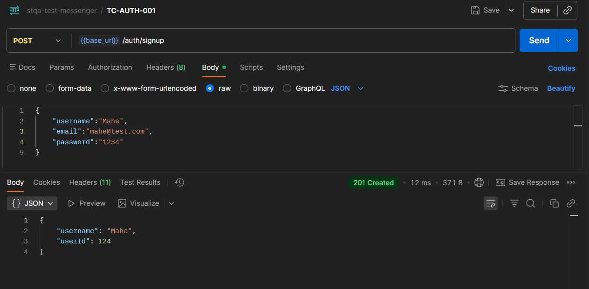

### TC-AUTH-002: Duplicate Username Signup

- **Pre-conditions:** User "alice" already exists
- **Steps:**
  1. POST /auth/signup
  2. Body: `{"username":"alice","email":"alice2@test.com","password":"1234"}`
- **Expected:** 400 Bad Request, "Username already taken"
- **Actual:** 400 Bad Request, returns `{Username already taken}`

- **Evidence:** 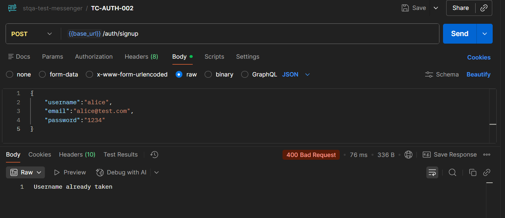

### TC-AUTH-003: Signup with Empty Username

- **Pre-conditions:** None
- **Steps:**
  1. POST /auth/signup
  2. Body: `{"username":"","email":"test@test.com","password":"1234"}`
- **Expected:** 400 Bad Request
- **Actual:** _[To be filled during testing]_
- **Evidence:** screenshot-auth-003.png

### TC-AUTH-004: Signup with Null Email

- **Pre-conditions:** None
- **Steps:**
  1. POST /auth/signup
  2. Body: `{"username":"testuser","email":null,"password":"1234"}`
- **Expected:** 400 Bad Request
- **Actual:** _[To be filled during testing]_
- **Evidence:** screenshot-auth-004.png

### TC-AUTH-005: Signup with Invalid Email Format

- **Pre-conditions:** None
- **Steps:**
  1. POST /auth/signup
  2. Body: `{"username":"testuser","email":"notanemail","password":"1234"}`
- **Expected:** 400 Bad Request (or accepts if no validation)
- **Actual:** _[To be filled during testing]_
- **Evidence:** screenshot-auth-005.png

### TC-AUTH-006: Signup with Empty Password

- **Pre-conditions:** None
- **Steps:**
  1. POST /auth/signup
  2. Body: `{"username":"testuser","email":"test@test.com","password":""}`
- **Expected:** 400 Bad Request
- **Actual:** _[To be filled during testing]_
- **Evidence:** screenshot-auth-006.png

### TC-AUTH-007: Valid Login

- **Pre-conditions:** User "alice" exists with password "1234"
- **Steps:**
  1. POST /auth/login
  2. Body: `{"username":"alice","password":"1234"}`
- **Expected:** 200 OK, returns JWT token and userId
- **Actual:** _[To be filled during testing]_
- **Evidence:** screenshot-auth-007.png

### TC-AUTH-008: Login with Wrong Password

- **Pre-conditions:** User "alice" exists
- **Steps:**
  1. POST /auth/login
  2. Body: `{"username":"alice","password":"wrong"}`
- **Expected:** 401 Unauthorized, "Invalid password"
- **Actual:** _[To be filled during testing]_
- **Evidence:** screenshot-auth-008.png

### TC-AUTH-009: Login with Non-existent User

- **Pre-conditions:** User "nobody" does not exist
- **Steps:**
  1. POST /auth/login
  2. Body: `{"username":"nobody","password":"1234"}`
- **Expected:** 401 Unauthorized, "User not found"
- **Actual:** _[To be filled during testing]_
- **Evidence:** screenshot-auth-009.png

### TC-AUTH-010: Logout

- **Pre-conditions:** User "alice" is logged in
- **Steps:**
  1. POST /auth/logout?username=alice
- **Expected:** 200 OK, "User logged out successfully"
- **Actual:** _[To be filled during testing]_
- **Evidence:** screenshot-auth-010.png

### TC-AUTH-011: Auth Test with Valid Token

- **Pre-conditions:** User "alice" logged in, has valid JWT token
- **Steps:**
  1. GET /auth/test
  2. Header: `Authorization: Bearer <valid_token>`
- **Expected:** 200 OK, "Hello, alice! This is a protected API."
- **Actual:** _[To be filled during testing]_
- **Evidence:** screenshot-auth-011.png

### TC-AUTH-012: Auth Test with Invalid Token

- **Pre-conditions:** None
- **Steps:**
  1. GET /auth/test
  2. Header: `Authorization: Bearer invalid_token_123`
- **Expected:** 403 Forbidden
- **Actual:** _[To be filled during testing]_
- **Evidence:** screenshot-auth-012.png

### TC-AUTH-013: Auth Test without Token

- **Pre-conditions:** None
- **Steps:**
  1. GET /auth/test
  2. No Authorization header
- **Expected:** 403 Forbidden
- **Actual:** _[To be filled during testing]_
- **Evidence:** screenshot-auth-013.png

### TC-AUTH-014: Invalid request method

- **Pre-conditions:** None
- **Steps:**
  1. GET /auth/signup
  2. Body: `{"username":"alice","email":"alice@test.com","password":"1234"}`
- **Expected:** 405 Method Not Allowed
- **Actual:** 405 Method Not Allowed, returns `{"timestamp":"2026-01-08T17:31:32.671Z","status":405,"error":"Method Not Allowed","path":"/auth/signup"}`
- **Evidence:** 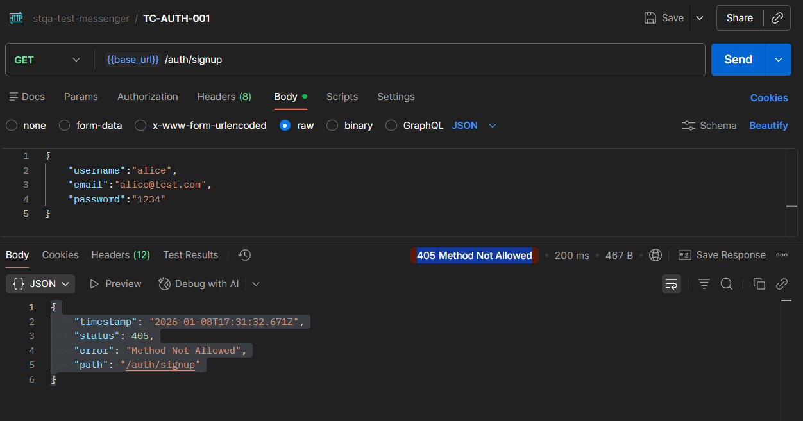

---

## PART 2: USER APIs

### TC-USER-001: Get All Users (Authorized)

- **Pre-conditions:** User "alice" logged in with valid token
- **Steps:**
  1. GET /users/
  2. Header: `Authorization: Bearer <alice_token>`
- **Expected:** 200 OK, returns array of users
- **Actual:** 200 OK, rerunes `[
    {
        "username": "alice",
        "email": null,
        "password": null,
        "userId": 101
    },
    {
        "username": "bob",
        "email": null,
        "password": null,
        "userId": 102
    },
    {
        "username": "charlie",
        "email": null,
        "password": null,
        "userId": 103
    },
    {
        "username": "david",
        "email": null,
        "password": null,
        "userId": 104
    },
    {
        "username": "eve",
        "email": null,
        "password": null,
        "userId": 105
    }
]`
- **Evidence:** 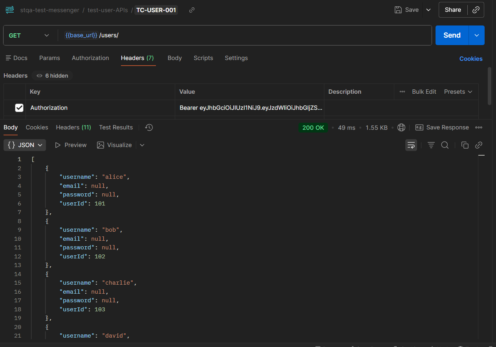

### TC-USER-002: Get All Users (Unauthorized)

- **Pre-conditions:** None
- **Steps:**
  1. GET /users/
  2. No Authorization header
- **Expected:** 401 Unauthorized
- **Actual:** 401 Unauthorized, returns `You must be logged in to view users`
- **Evidence:** 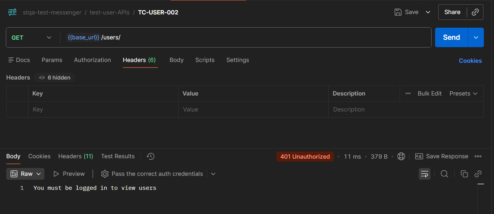

### TC-USER-003: Get User by Valid ID

- **Pre-conditions:** User "alice" (userId: 101) exists, user logged in
- **Steps:**
  1. GET /users/101
  2. Header: `Authorization: Bearer <token>`
- **Expected:** 200 OK, returns alice's user object
- **Actual:** 200 OK, returns `{
    "username": "alice",
    "email": "alice@test.com",
    "password": "password123",
    "userId": 101
}`
- **Evidence:** 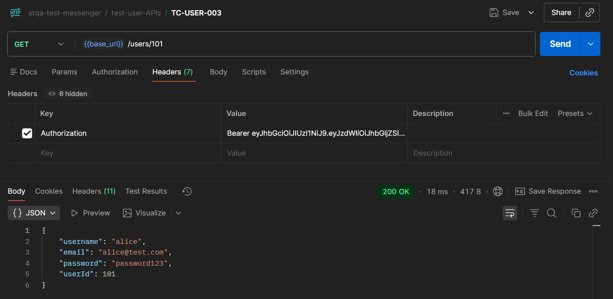

### TC-USER-004: Get User by Invalid ID

- **Pre-conditions:** User logged in
- **Steps:**
  1. GET /users/999
  2. Header: `Authorization: Bearer <token>`
- **Expected:** 404 Not Found, "User not found"
- **Actual:** 404 Not Found, returns `User not found`
- **Evidence:** 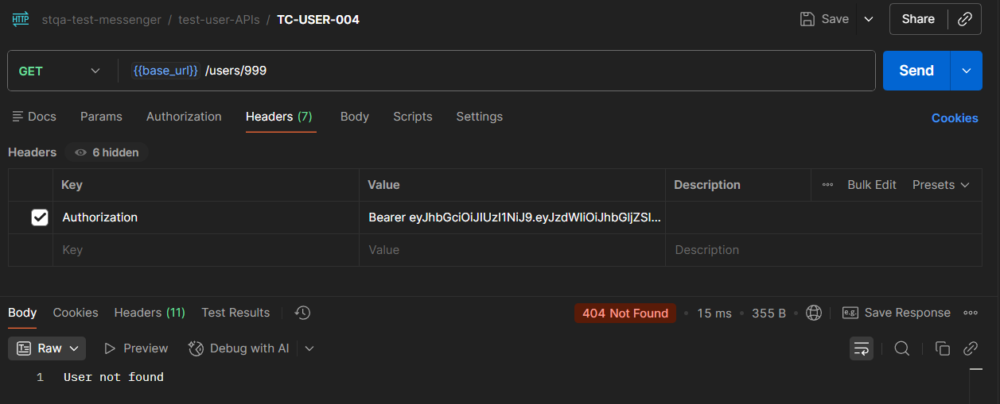

### TC-USER-005: Get User by Valid Username

- **Pre-conditions:** User "alice" exists, user logged in
- **Steps:**
  1. GET /users/username/alice
  2. Header: `Authorization: Bearer <token>`
- **Expected:** 200 OK, returns alice's user object
- **Actual:** 200 OK, returns `{
    "username": "alice",
    "email": "alice@test.com",
    "password": "password123",
    "userId": 101
}`
- **Evidence:** 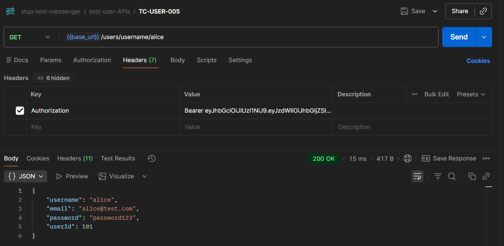

### TC-USER-006: Get User by Non-existent Username

- **Pre-conditions:** User logged in
- **Steps:**
  1. GET /users/username/nobody
  2. Header: `Authorization: Bearer <token>`
- **Expected:** 404 Not Found, "User not found"
- **Actual:** 404 Not Found, returns `User not found`
- **Evidence:** 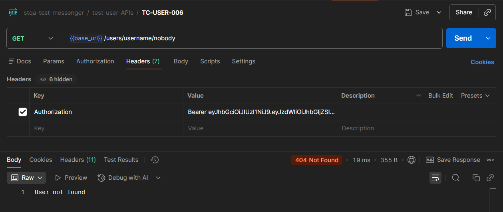

### TC-USER-007: Update Own User (Valid)

- **Pre-conditions:** User "alice" (userId: 101) logged in
- **Steps:**
  1. PATCH /users/101
  2. Header: `Authorization: Bearer <alice_token>`
  3. Body: `{"email":"newemail@test.com"}`
- **Expected:** 200 OK, user updated successfully
- **Actual:** 200 OK, returns `{
    "message": "User updated successfully",
    "data": {
        "username": "alice",
        "email": "newemail@test.com",
        "password": "password123",
        "userId": 101
    }
}`
- **Evidence:** 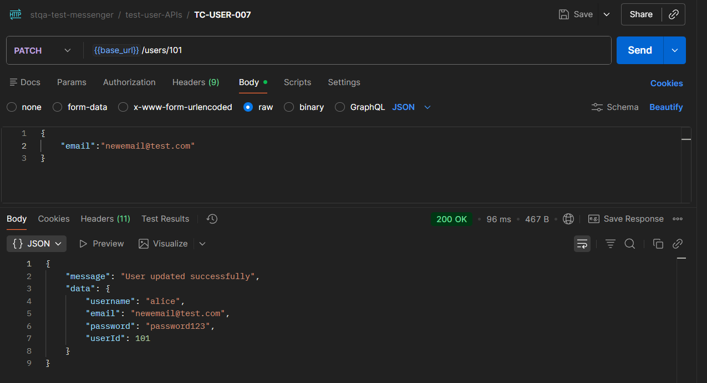

### TC-USER-008: Update Another User (Forbidden)

- **Pre-conditions:** User "alice" (userId: 101) and "bob" (userId: 102) exist, alice logged in
- **Steps:**
  1. PATCH /users/102
  2. Header: `Authorization: Bearer <alice_token>`
  3. Body: `{"email":"hacked@test.com"}`
- **Expected:** 403 Forbidden, "You can only update your own user details"
- **Actual:** 403 Forbidden, retunrs `You can only update your own user details`
- **Evidence:** 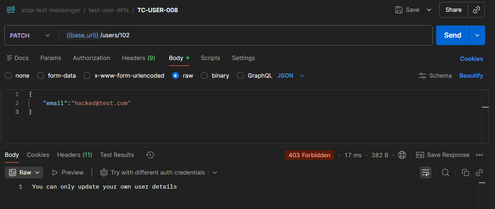

### TC-USER-009: Update User with ID in Body (Invalid)

- **Pre-conditions:** User "alice" (userId: 101) logged in
- **Steps:**
  1. PATCH /users/101
  2. Header: `Authorization: Bearer <alice_token>`
  3. Body: `{"userId":999,"email":"test@test.com"}`
- **Expected:** 400 Bad Request, "User ID cannot be updated"
- **Actual:** 200 OK, returns `{
    "message": "User updated successfully",
    "data": {
        "username": "alice",
        "email": "test@test.com",
        "password": "password123",
        "userId": 101
    }
}`
- **Verdict:** It is a **Defect**
- **Evidence:** 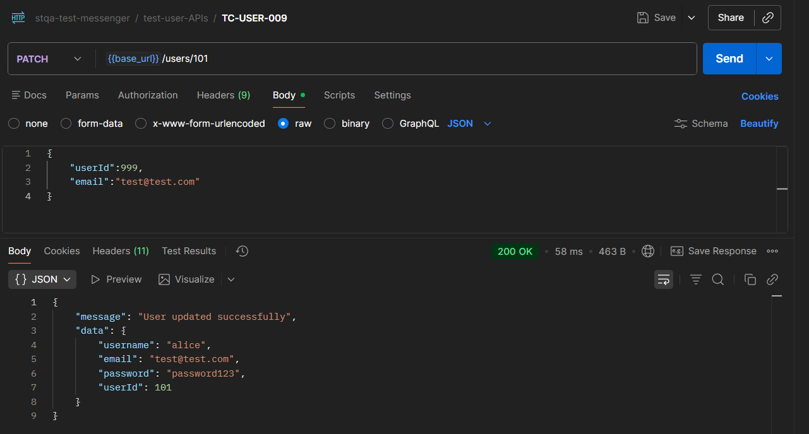

### TC-USER-010: Block User (Valid)

- **Pre-conditions:** User "alice" (101) and "bob" (102) exist, alice logged in
- **Steps:**
  1. PATCH /users/block/102
  2. Header: `Authorization: Bearer <alice_token>`
- **Expected:** 200 OK, "User blocked successfully"
- **Actual:** 200 OK, returns `{
    "message": "User blocked successfully",
    "data": null
}`
- **Evidence:** 

### TC-USER-011: Block Non-existent User

- **Pre-conditions:** User "alice" logged in
- **Steps:**
  1. PATCH /users/block/999
  2. Header: `Authorization: Bearer <alice_token>`
- **Expected:** 400 Bad Request, "User to be blocked not found"
- **Actual:** 400 Bad Request, returns `User to be blocked not found`
- **Evidence:** 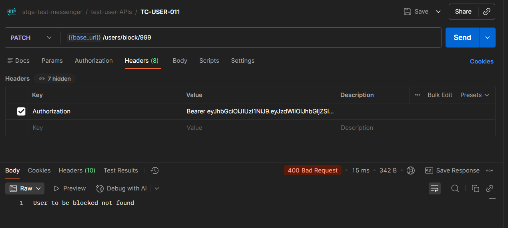

### TC-USER-012: Block Self

- **Pre-conditions:** User "alice" (userId: 101) logged in
- **Steps:**
  1. PATCH /users/block/101
  2. Header: `Authorization: Bearer <alice_token>`
- **Expected:** 400 Bad Request (or accepts - test to see)
- **Actual:** 200 OK, returns `{
    "message": "User blocked successfully",
    "data": null
}`
- **Verdict:** It is a **Defect**
- **Evidence:** 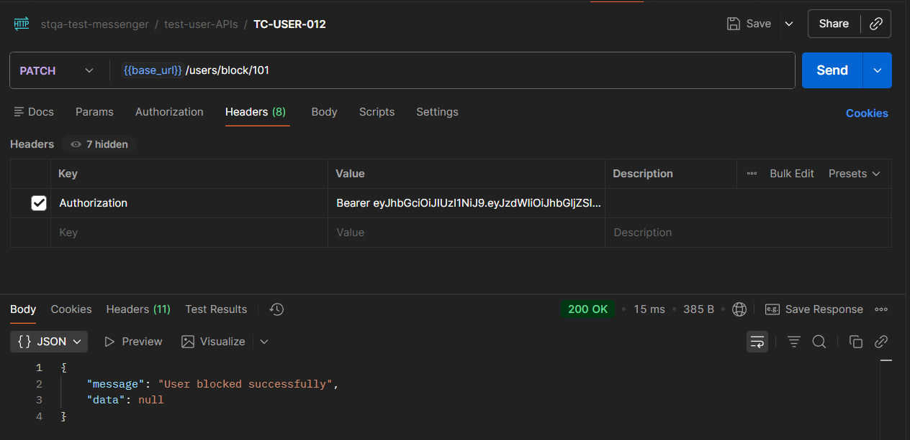

### TC-USER-013: Unblock User (Valid)

- **Pre-conditions:** User "alice" has blocked "bob"
- **Steps:**
  1. DELETE /users/block/102
  2. Header: `Authorization: Bearer <alice_token>`
- **Expected:** 200 OK, "User unblocked successfully"
- **Actual:** 200 OK, returns `{
    "message": "User unblocked successfully",
    "data": null
}`
- **Evidence:** 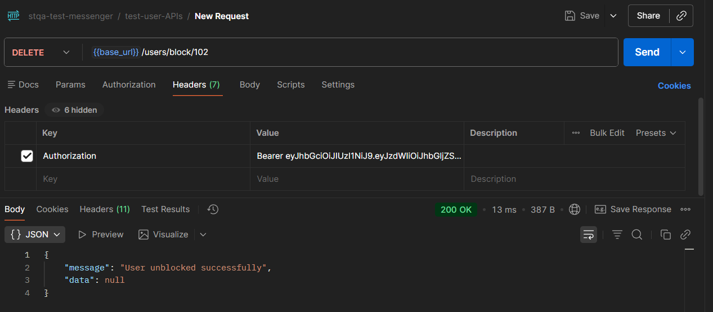

### TC-USER-014: Unblock User Not Blocked

- **Pre-conditions:** User "alice" has NOT blocked "bob"
- **Steps:**
  1. DELETE /users/block/102
  2. Header: `Authorization: Bearer <alice_token>`
- **Expected:** 400 Bad Request or 200 OK (test to see)
- **Actual:** 400 Bad Request, returns `Failed to unblock user`
- **Evidence:** 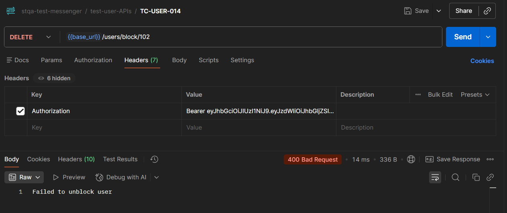
---

## PART 3: CONVERSATION APIs

### TC-CONV-001: Create DIRECT Conversation (Valid)

- **Pre-conditions:** User "alice" (101) and "bob" (102) exist, alice logged in, no existing DIRECT between them
- **Steps:**
  1. POST /conversations/create
  2. Header: `Authorization: Bearer <alice_token>`
  3. Body: `{"type":"DIRECT","name":null,"memberIds":[102]}`
- **Expected:** 200 OK, returns conversationId
- **Actual:** 200 OK, returns `{
    "type": "DIRECT",
    "name": null,
    "conversationId": 203
}`
- **Evidence:** 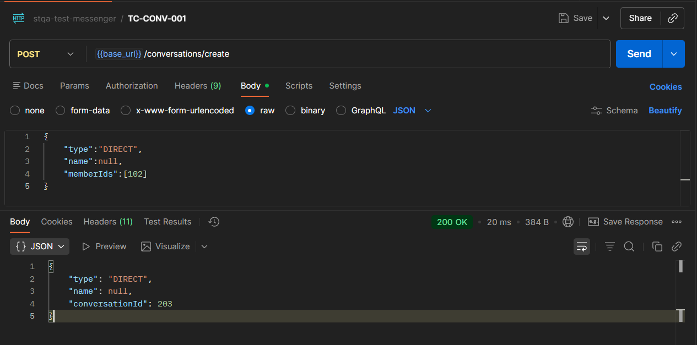

### TC-CONV-002: Create Duplicate DIRECT Conversation

- **Pre-conditions:** DIRECT conversation already exists between alice (101) and bob (102)
- **Steps:**
  1. POST /conversations/create
  2. Header: `Authorization: Bearer <alice_token>`
  3. Body: `{"type":"DIRECT","name":null,"memberIds":[102]}`
- **Expected:** 400 Bad Request or returns existing conversation (test to see)
- **Actual:** 400 Bad Request, returns `{
    "timestamp": "2026-01-08T19:41:38.067Z",
    "status": 400,
    "error": "Bad Request",
    "path": "/conversations/create"
}`
- **Evidence:** 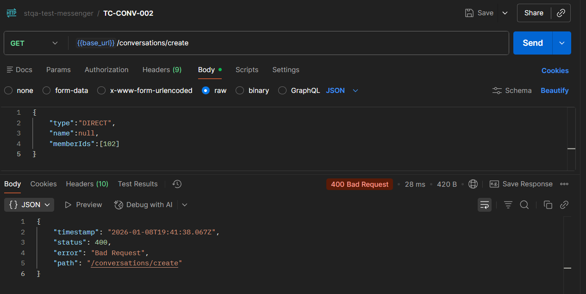

### TC-CONV-003: Create GROUP Conversation (Valid)

- **Pre-conditions:** Users alice (101), bob (102), charlie (103) exist, alice logged in
- **Steps:**
  1. POST /conversations/create
  2. Header: `Authorization: Bearer <alice_token>`
  3. Body: `{"type":"GROUP","name":"Test Group","memberIds":[102,103]}`
- **Expected:** 200 OK, returns conversationId, alice auto-included
- **Actual:** 200 OK, returns `{
    "type": "GROUP",
    "name": "Friends Forever !!!",
    "conversationId": 204
}`
- **Evidence:** 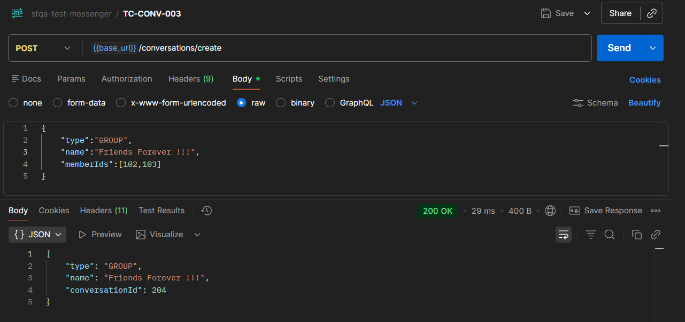

### TC-CONV-004: Create GROUP with Empty Name

- **Pre-conditions:** Users alice (101), bob (102) exist, alice logged in
- **Steps:**
  1. POST /conversations/create
  2. Header: `Authorization: Bearer <alice_token>`
  3. Body: `{"type":"GROUP","name":"","memberIds":[102]}`
- **Expected:** 400 Bad Request or accepts empty name (test to see)
- **Actual:** 200 OK, returns `{
    "type": "GROUP",
    "name": "",
    "conversationId": 206
}`
- **Verdict:** This is a **Defect**
- **Evidence:** 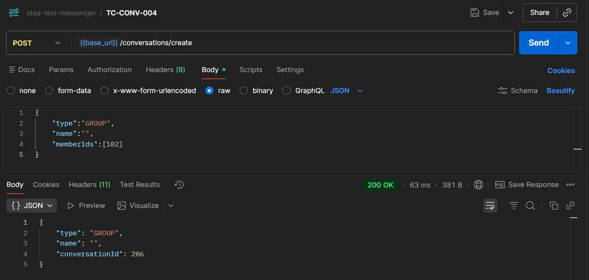

### TC-CONV-005: Create DIRECT with Non-existent User

- **Pre-conditions:** User alice logged in
- **Steps:**
  1. POST /conversations/create
  2. Header: `Authorization: Bearer <alice_token>`
  3. Body: `{"type":"DIRECT","name":null,"memberIds":[999]}`
- **Expected:** 400 Bad Request, "User not found"
- **Actual:** 200 OK, returns `{
    "type": "DIRECT",
    "name": null,
    "conversationId": 207
}`
- **Verdict:** This is a **Defect**
- **Evidence:** 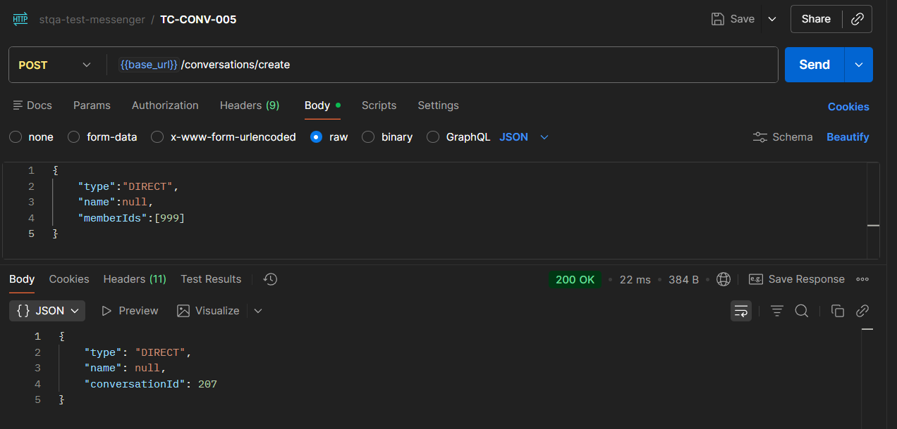

### TC-CONV-006: Create DIRECT with Blocked User

- **Pre-conditions:** Alice has blocked Bob (102)
- **Steps:**
  1. POST /conversations/create
  2. Header: `Authorization: Bearer <alice_token>`
  3. Body: `{"type":"DIRECT","name":null,"memberIds":[102]}`
- **Expected:** 400 Bad Request, cannot create conversation with blocked user
- **Actual:** 200 OK, returns `{
    "type": "DIRECT",
    "name": null,
    "conversationId": 208
}`
- **Verdict:** This is a **Defect**
- **Evidence:** 

### TC-CONV-007: Get My Conversations

- **Pre-conditions:** Alice has 3 conversations, logged in
- **Steps:**
  1. GET /conversations/get
  2. Header: `Authorization: Bearer <alice_token>`
- **Expected:** 200 OK, returns array with 3 conversations
- **Actual:** 200 OK, returns `[
    {
        "type": "DIRECT",
        "name": null,
        "conversationId": 201
    },
    {
        "type": "GROUP",
        "name": "Test Group",
        "conversationId": 202
    },
    {
        "type": "DIRECT",
        "name": null,
        "conversationId": 203
    }
]`
- **Evidence:** 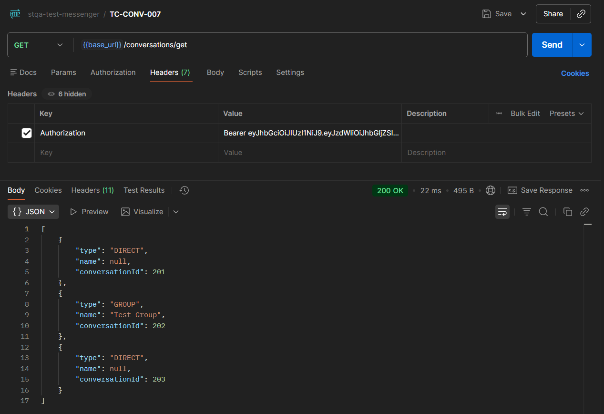

### TC-CONV-008: Get Conversation by ID (Member)

- **Pre-conditions:** Conversation 201 exists, alice is member, logged in
- **Steps:**
  1. GET /conversations/201
  2. Header: `Authorization: Bearer <alice_token>`
- **Expected:** 200 OK, returns conversation details
- **Actual:** 200 OK, returns `{
    "type": "DIRECT",
    "name": null,
    "conversationId": 201
}`
- **Evidence:** 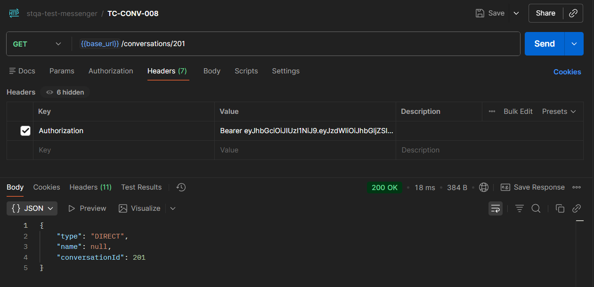

### TC-CONV-009: Get Conversation by ID (Non-member)

- **Pre-conditions:** Conversation 204 exists(between Eve and Frank), alice is NOT member
- **Steps:**
  1. GET /conversations/204
  2. Header: `Authorization: Bearer <alice_token>`
- **Expected:** 400 Bad Request, "User is not a member of this conversation"
- **Actual:** 400 Bad Request, returns `"User is not a member of this conversation"`
- **Evidence:** 

### TC-CONV-010: Get Non-existent Conversation

- **Pre-conditions:** User alice logged in
- **Steps:**
  1. GET /conversations/999
  2. Header: `Authorization: Bearer <alice_token>`
- **Expected:** 400 Bad Request, "Conversation not found"
- **Actual:** 400 Bad Request, returns `"Conversation not found"`
- **Evidence:** 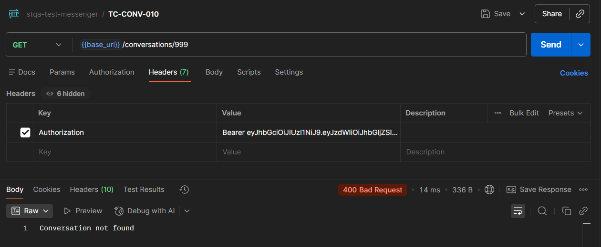

### TC-CONV-011: Add Member to GROUP (Creator)

- **Pre-conditions:** GROUP conversation 202 exists, alice is creator, david (104) exists
- **Steps:**
  1. POST /conversations/addMember
  2. Header: `Authorization: Bearer <alice_token>`
  3. Body: `{"conversationId":202,"members":[104]}`
- **Expected:** 200 OK, "Members added successfully"
- **Actual:** 200 OK, returns `{
    "message": "Members added successfully",
    "conversationId": 202,
    "memberIds": [
        101,
        102,
        103,
        104
    ]
}`
- **Evidence:** 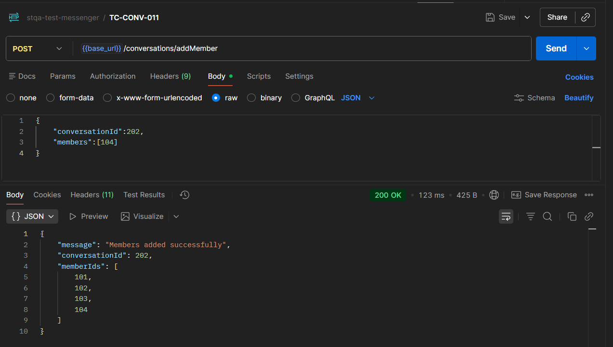

### TC-CONV-012: Add Member to GROUP (Non-creator)

- **Pre-conditions:** GROUP 202 exists, alice is creator, bob is member (not creator)
- **Steps:**
  1. POST /conversations/addMember
  2. Header: `Authorization: Bearer <bob_token>`
  3. Body: `{"conversationId":202,"members":[104]}`
- **Expected:** 400 Bad Request, only creator can add (per spec)
- **Actual:** 200 OK, returns `{
    "message": "Members added successfully",
    "conversationId": 202,
    "memberIds": [
        101,
        102,
        103,
        104
    ]
}`
- **Verdict:** This is a **Defect**
- **Evidence:** 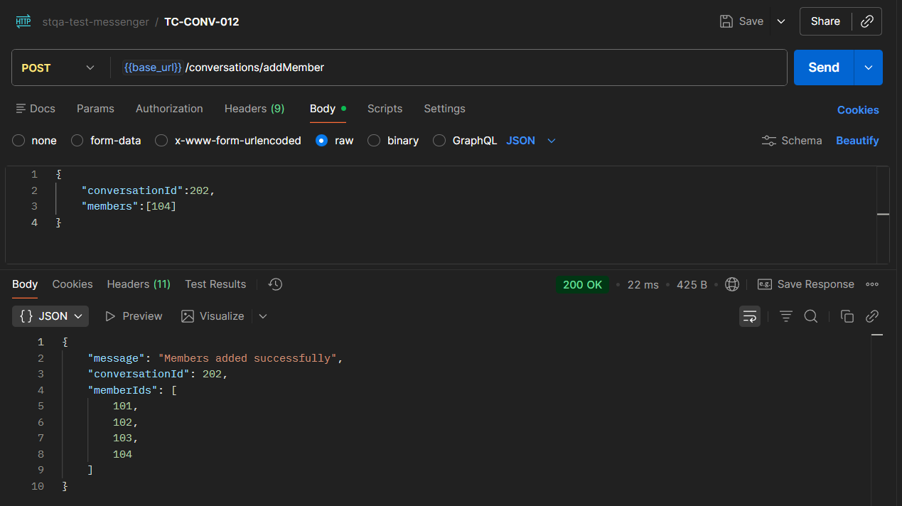

### TC-CONV-013: Add Blocked User to GROUP

- **Pre-conditions:** GROUP 202 exists, alice is creator, alice blocked jack(110)
- **Steps:**
  1. POST /conversations/addMember
  2. Header: `Authorization: Bearer <alice_token>`
  3. Body: `{"conversationId":202,"members":[110]}`
- **Expected:** 400 Bad Request, cannot add blocked user
- **Actual:** 200 OK, returns `{
    "message": "Members added successfully",
    "conversationId": 202,
    "memberIds": [
        101,
        102,
        103,
        104,
        110
    ]
}`
- **Evidence:** 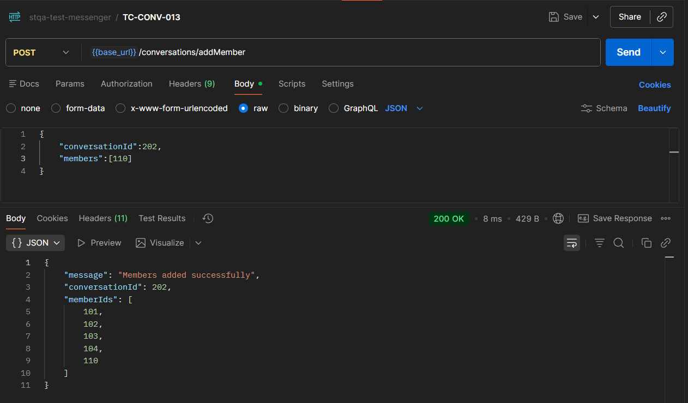

### TC-CONV-014: Add Member to DIRECT Conversation

- **Pre-conditions:** DIRECT conversation 201 between alice and bob exists, add jack (110)
- **Steps:**
  1. POST /conversations/addMember
  2. Header: `Authorization: Bearer <alice_token>`
  3. Body: `{"conversationId":201,"members":[110]}`
- **Expected:** 400 Bad Request, cannot add to DIRECT (test to see)
- **Actual:** 200 OK, returns `{
    "message": "Members added successfully",
    "conversationId": 201,
    "memberIds": [
        101,
        102,
        103,
        110
    ]
}`
- **Evidence:** 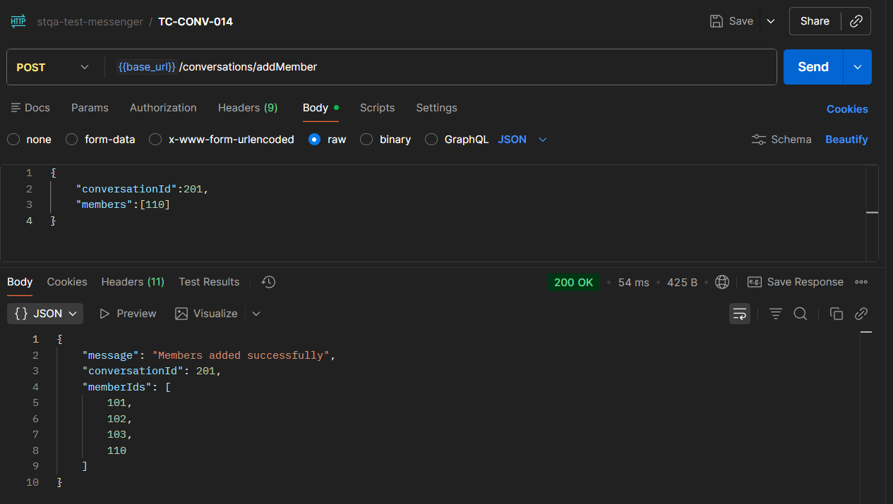

### TC-CONV-015: Remove Member from GROUP (Creator)

- **Pre-conditions:** GROUP 202 exists, alice is creator, bob (102) is member
- **Steps:**
  1. POST /conversations/removeMember
  2. Header: `Authorization: Bearer <alice_token>`
  3. Body: `{"conversationId":202,"members":[102]}`
- **Expected:** 200 OK, "Member removed successfully"
- **Actual:** 200 OK, returns `{
    "message": "Member removed successfully",
    "conversationId": 202,
    "memberIds": [
        101,
        103,
        104,
        110
    ]
}`
- **Evidence:** 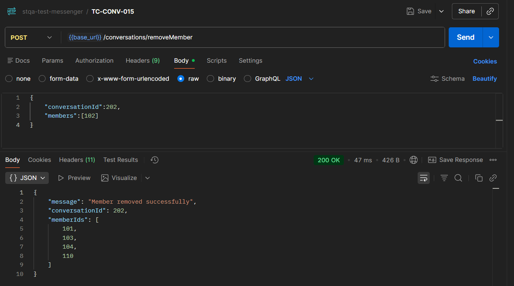

### TC-CONV-016: Remove Member from GROUP (Non-creator)

- **Pre-conditions:** GROUP 202 exists, alice(101) is creator, bob(102) is member
- **Steps:**
  1. POST /conversations/removeMember
  2. Header: `Authorization: Bearer <bob_token>`
  3. Body: `{"conversationId":202,"members":[103]}`
- **Expected:** 400 Bad Request, only creator can remove
- **Actual:** 500 Internal Server Error, returns `{
    "timestamp": "2026-01-09T15:28:50.778Z",
    "status": 500,
    "error": "Internal Server Error",
    "path": "/conversations/removeMember"
}`
- **Evidence:** 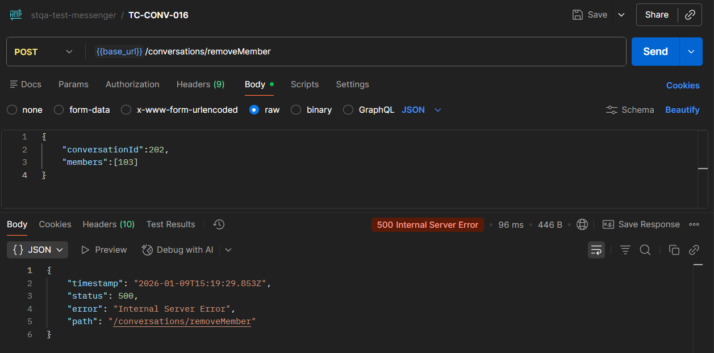

### TC-CONV-017: Remove Self from GROUP

- **Pre-conditions:** GROUP 201 exists, bob(102) is a member
- **Steps:**
  1. POST /conversations/removeMember
  2. Header: `Authorization: Bearer <bob_token>`
  3. Body: `{"conversationId":201,"members":[102]}`
- **Expected:** 200 OK or 400 (test to see - can user leave group?)
- **Actual:** 200 OK, returns `{
    "message": "Member removed successfully",
    "conversationId": 201,
    "memberIds": [
        101,
        103,
        110
    ]
}`
- **Evidence:** 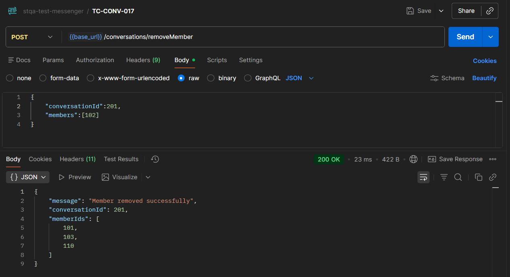

### TC-CONV-018: Add a third Member (charlie - 103) to DIRECT Conversation, between Alice (101) and Bob (102)

- **Pre-conditions:** DIRECT conversation 201 between alice and bob
- **Steps:**
  1. POST /conversations/addMember
  2. Header: `Authorization: Bearer <alice_token>`
  3. Body: `{"conversationId":201,"members":[103]}`
- **Expected:** 400 Bad Request, cannot add to DIRECT (test to see)
- **Actual:** 200 OK, returns `{
    "message": "Members added successfully",
    "conversationId": 201,
    "memberIds": [
        101,
        102,
        103
    ]
}`
- **Verdict:** This is a **Defect**
- **Evidence:** 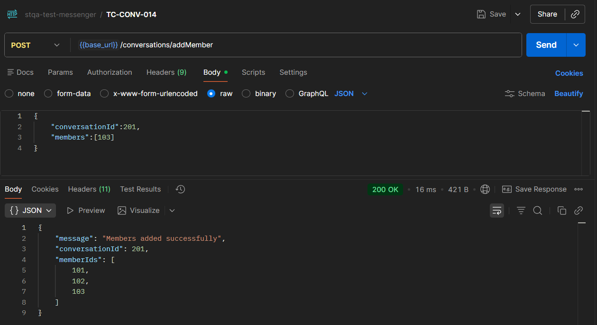

---

## PART 4: MESSAGE APIs

### TC-MSG-001: Send Message in DIRECT (Valid)

- **Pre-conditions:** DIRECT conversation 201 between alice and bob, alice logged in
- **Steps:**
    1. POST /messages/201/send
    2. Header: `Authorization: Bearer <alice_token>`, `Content-Type: text/plain`
    3. Body: `Hello Bob!`
- **Expected:** 200 OK, "Message sent successfully"
- **Actual:** 200 OK, returns `{
  "message": "Message sent successfully",
  "data": [
  {
  "id": 1001,
  "conversationId": 201,
  "senderId": 101,
  "content": "Hello Bob! কি অবস্থা ভাই !!! ",
  "timestamp": 1767974142471
  }
  ]
  }`
- **Evidence:** 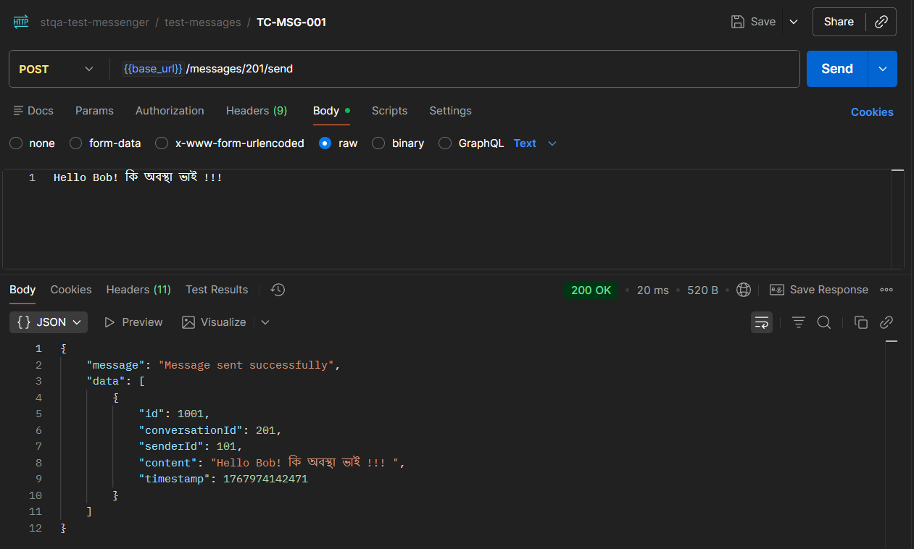

### TC-MSG-002: Send Message in GROUP (Valid)

- **Pre-conditions:** GROUP conversation 202, alice is member
- **Steps:**
    1. POST /messages/202/send
    2. Header: `Authorization: Bearer <alice_token>`, `Content-Type: text/plain`
    3. Body: `Hello everyone!`
- **Expected:** 200 OK, "Message sent successfully"
- **Actual:** 200 OK, returns `{
  "message": "Message sent successfully",
  "data": [
  {
  "id": 1008,
  "conversationId": 202,
  "senderId": 101,
  "content": "Hello everyone! Welcome to the test group.",
  "timestamp": 1767974377481
  },
  {
  "id": 1009,
  "conversationId": 202,
  "senderId": 102,
  "content": "Thanks Alice! Happy to be here.",
  "timestamp": 1767974377490
  },
  {
  "id": 1010,
  "conversationId": 202,
  "senderId": 103,
  "content": "Hi team!",
  "timestamp": 1767974377497
  },
  {
  "id": 1014,
  "conversationId": 202,
  "senderId": 101,
  "content": "Hello everyone! কেমন আছো সবাই ? ",
  "timestamp": 1767974525076
  }
  ]
  }`
- **Evidence:** 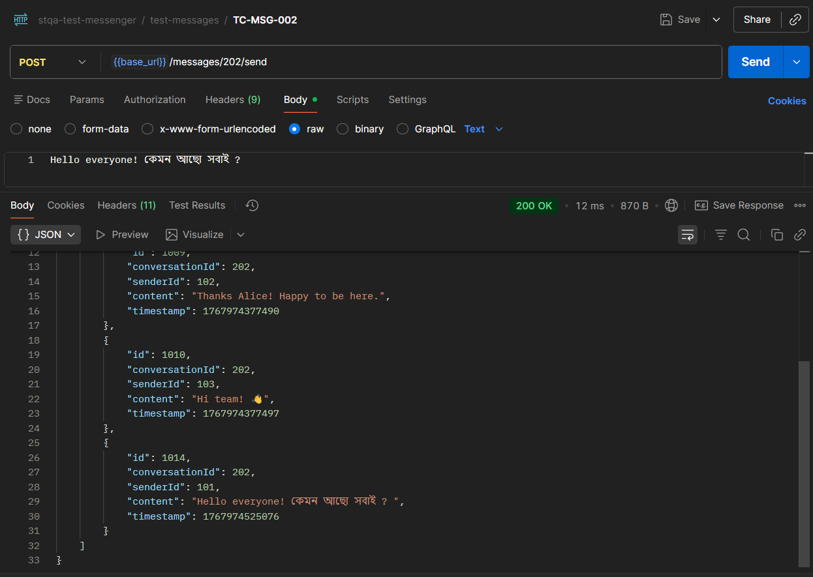

### TC-MSG-003: Send Message (Non-member)

- **Pre-conditions:** Conversation 202 exists, eve(105) is NOT member
- **Steps:**
    1. POST /messages/202/send
    2. Header: `Authorization: Bearer <alice_token>`, `Content-Type: text/plain`
    3. Body: `Trying to hack in`
- **Expected:** 400 Bad Request, "User is not a member of this conversation"
- **Actual:** 400 Bad Request, returns `{
  "message": "User is not a member of this conversation",
  "data": null
  }`
- **Evidence:** 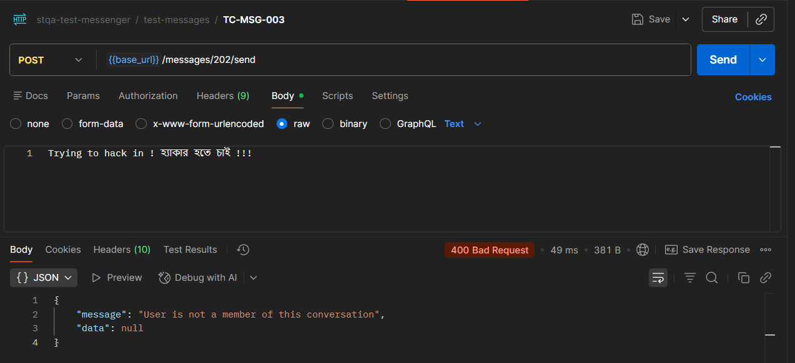

### TC-MSG-004: Send Empty Message

- **Pre-conditions:** DIRECT conversation 201, alice is member
- **Steps:**
    1. POST /messages/201/send
    2. Header: `Authorization: Bearer <alice_token>`, `Content-Type: text/plain`
    3. Body: ``
- **Expected:** 400 Bad Request or accepts empty (test to see)
- **Actual:** 200 OK, returns ``
- **Verdict:** It's a **Defect**
- **Evidence:** 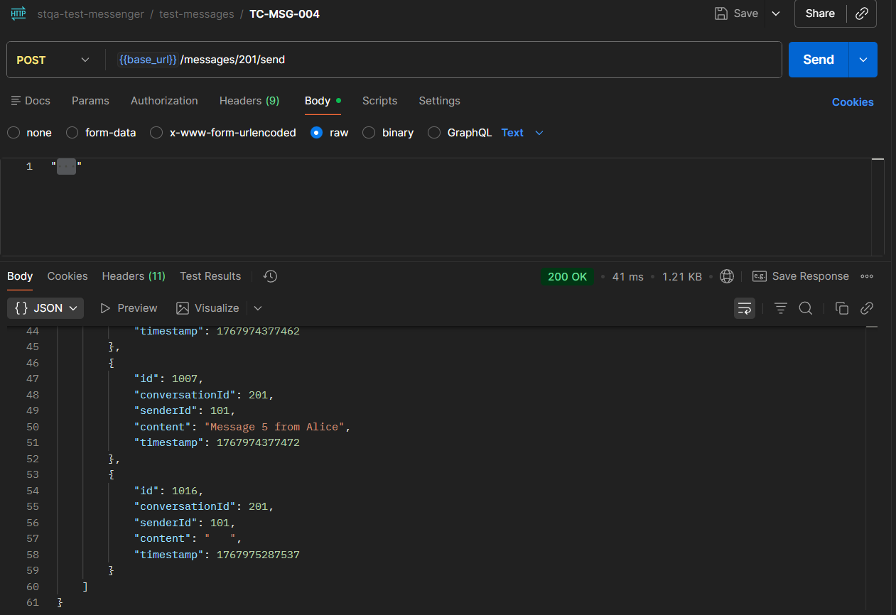

### TC-MSG-005: Send Very Long Message

- **Pre-conditions:** DIRECT conversation 201, alice is member
- **Steps:**
    1. POST /messages/201/send
    2. Header: `Authorization: Bearer <alice_token>`, `Content-Type: text/plain`
    3. Body: `[10000 characters string]`
- **Expected:** 200 OK or 400 if length limit (test to see)
- **Actual:** 200 OK, returns `{
  "message": "Message sent successfully",
  "data": [
  {
  "id": 1001,
  "conversationId": 201,
  "senderId": 101,
  "content": "Hello Bob! This is a test message.",
  "timestamp": 1767974377414
  },
  {
  "id": 1002,
  "conversationId": 201,
  "senderId": 102,
  "content": "Hi Alice! Got your message.",
  "timestamp": 1767974377421
  },
  {
  "id": 1003,
  "conversationId": 201,
  "senderId": 101,
  "content": "Message 1 from Alice",
  "timestamp": 1767974377432
  },
  {
  "id": 1004,
  "conversationId": 201,
  "senderId": 101,
  "content": "Message 2 from Alice",
  "timestamp": 1767974377443
  },
  {
  "id": 1005,
  "conversationId": 201,
  "senderId": 101,
  "content": "Message 3 from Alice",
  "timestamp": 1767974377453
  },
  {
  "id": 1006,
  "conversationId": 201,
  "senderId": 101,
  "content": "Message 4 from Alice",
  "timestamp": 1767974377462
  },
  {
  "id": 1007,
  "conversationId": 201,
  "senderId": 101,
  "content": "Message 5 from Alice",
  "timestamp": 1767974377472
  },
  {
  "id": 1016,
  "conversationId": 201,
  "senderId": 101,
  "content": "   ",
  "timestamp": 1767975287537
  },
  {
  "id": 1017,
  "conversationId": 201,
  "senderId": 101,
  "content": "1 million unsorted numbers!",
  "timestamp": 1767975599697
  }
  ]
  }`
- **Evidence:** 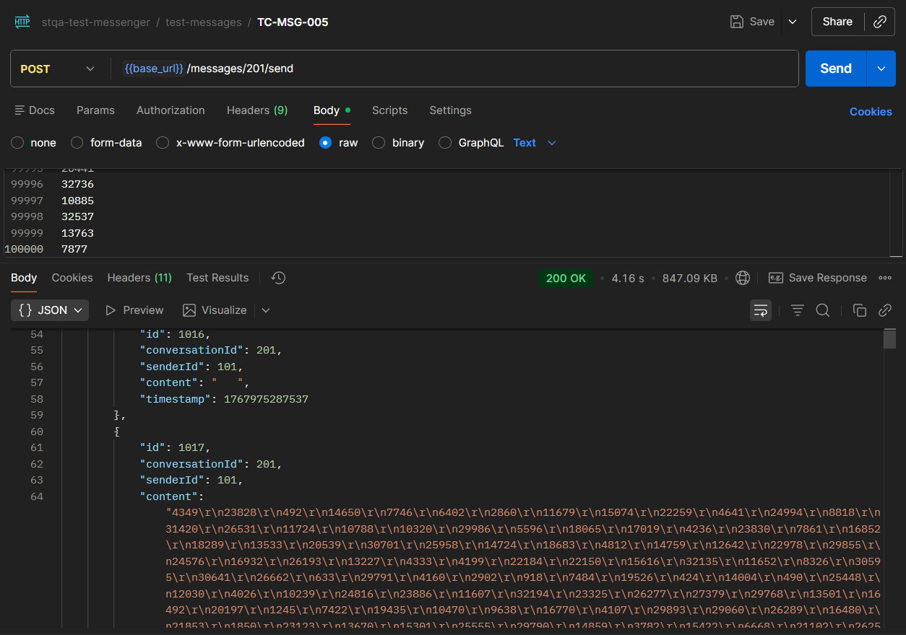

### TC-MSG-006: Send Message in DIRECT (Receiver Blocked Sender)

- **Pre-conditions:** DIRECT 201 between alice and bob, bob blocked alice
- **Steps:**
  1. POST /messages/201/send
  2. Header: `Authorization: Bearer <alice_token>`, `Content-Type: text/plain`
  3. Body: `Can you see this?`
- **Expected:** 400 Bad Request, "You must unblock the user to send messages"
- **Actual:** 400 Bad Request, returns `{
  "timestamp": "2026-01-10T13:20:26.716Z",
  "status": 405,
  "error": "Method Not Allowed",
  "path": "/messages/201/send"
  }`
- **Evidence:** 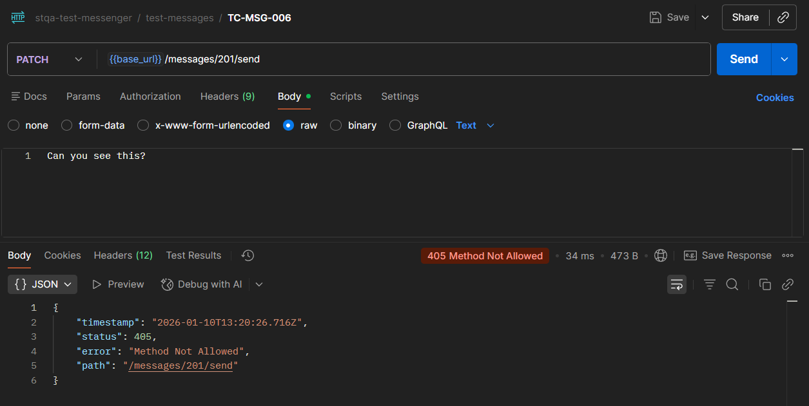

### TC-MSG-007: Send Message in DIRECT (Sender Blocked Receiver)

- **Pre-conditions:** DIRECT 201 between alice and bob, alice blocked bob
- **Steps:**
  1. POST /messages/201/send
  2. Header: `Authorization: Bearer <alice_token>`, `Content-Type: text/plain`
  3. Body: `You're blocked!`
- **Expected:** 400 Bad Request, "You cannot send message to this conversation"
- **Actual:** 400 bad Request, returns `{
  "message": "You must unblock the user to send messages",
  "data": null
  }`
- **Evidence:** 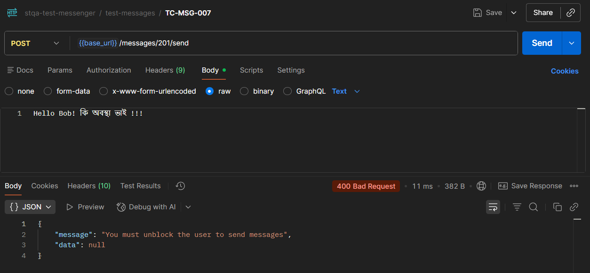

### TC-MSG-008: Send Message in GROUP (Member Blocked Another)

- **Pre-conditions:** GROUP 202 with alice, bob, charlie. Alice blocked bob
- **Steps:**
  1. POST /messages/202/send
  2. Header: `Authorization: Bearer <alice_token>`, `Content-Type: text/plain`
  3. Body: `Hello group!`
- **Expected:** 200 OK (blocking doesn't affect GROUP per spec)
- **Actual:** 200 OK, returns `{
  "message": "Message sent successfully",
  "data": [
  {
  "id": 1008,
  "conversationId": 202,
  "senderId": 101,
  "content": "Hello everyone! Welcome to the test group.",
  "timestamp": 1768051377823
  },
  {
  "id": 1009,
  "conversationId": 202,
  "senderId": 102,
  "content": "Thanks Alice! Happy to be here.",
  "timestamp": 1768051377830
  },
  {
  "id": 1010,
  "conversationId": 202,
  "senderId": 103,
  "content": "Hi team! 👋",
  "timestamp": 1768051377836
  },
  {
  "id": 1014,
  "conversationId": 202,
  "senderId": 101,
  "content": "Hello group! Bob are you there !!! ",
  "timestamp": 1768051700889
  },
  {
  "id": 1015,
  "conversationId": 202,
  "senderId": 101,
  "content": "Hello group!",
  "timestamp": 1768051777607
  }
  ]
  }`
- **Evidence:** 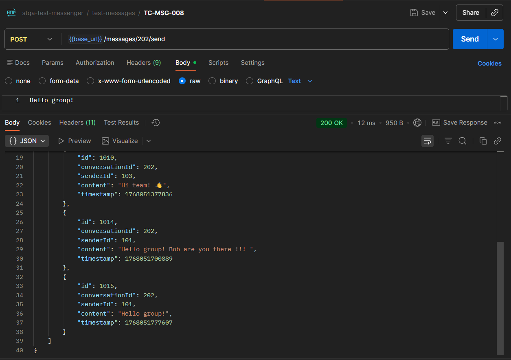

### TC-MSG-009: Send Message to Non-existent Conversation

- **Pre-conditions:** User alice logged in
- **Steps:**
  1. POST /messages/999/send
  2. Header: `Authorization: Bearer <alice_token>`, `Content-Type: text/plain`
  3. Body: `Ghost message`
- **Expected:** 400 Bad Request, "Conversation not found"
- **Actual:** 400 Bad Request, returns `{
  "message": "Conversation not found",
  "data": null
  }`
- **Evidence:** 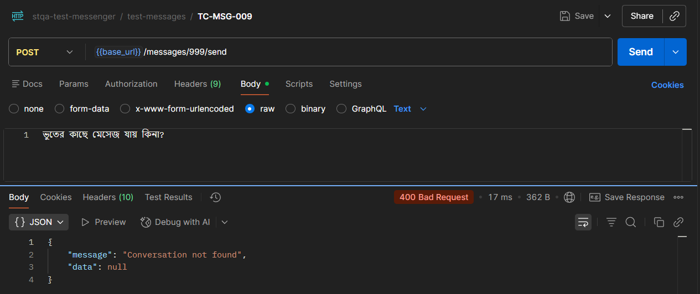

### TC-MSG-010: Get Messages from Conversation (Member)

- **Pre-conditions:** Conversation 201 with 5 messages, alice is member
- **Steps:**
  1. GET /messages/201/get?page=0&size=20
  2. Header: `Authorization: Bearer <alice_token>`
- **Expected:** 200 OK, returns array of 5 messages
- **Actual:** 200 OK, returns `{
  "message": "Messages retrieved successfully",
  "data": [
  {
  "id": 1001,
  "conversationId": 201,
  "senderId": 101,
  "content": "Hello Bob! This is a test message.",
  "timestamp": 1768051377772
  },
  {
  "id": 1002,
  "conversationId": 201,
  "senderId": 102,
  "content": "Hi Alice! Got your message.",
  "timestamp": 1768051377780
  },
  {
  "id": 1003,
  "conversationId": 201,
  "senderId": 101,
  "content": "Message 1 from Alice",
  "timestamp": 1768051377789
  },
  {
  "id": 1004,
  "conversationId": 201,
  "senderId": 101,
  "content": "Message 2 from Alice",
  "timestamp": 1768051377795
  },
  {
  "id": 1005,
  "conversationId": 201,
  "senderId": 101,
  "content": "Message 3 from Alice",
  "timestamp": 1768051377803
  },
  {
  "id": 1006,
  "conversationId": 201,
  "senderId": 101,
  "content": "Message 4 from Alice",
  "timestamp": 1768051377810
  },
  {
  "id": 1007,
  "conversationId": 201,
  "senderId": 101,
  "content": "Message 5 from Alice",
  "timestamp": 1768051377816
  }
  ]
  }`
- **Evidence:** 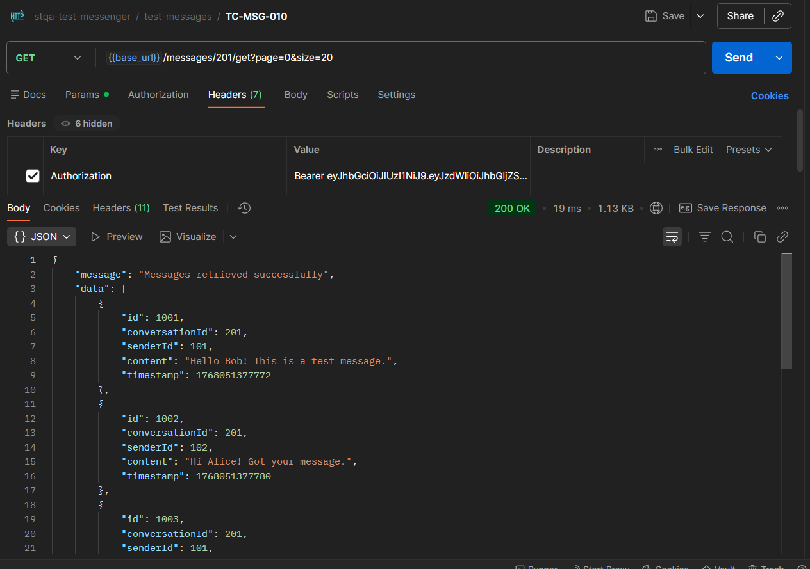

### TC-MSG-011: Get Messages (Non-member)

- **Pre-conditions:** Conversation 203 exists, alice is NOT member
- **Steps:**
  1. GET /messages/202/get?page=0&size=20
  2. Header: `Authorization: Bearer <alice_token>`
- **Expected:** 400 Bad Request, "Cannot access messages for this conversation"
- **Actual:** 400 bad Request, returns `{
  "message": "Cannot access messages for this conversation: User is not a member of this conversation",
  "data": null
  }`
- **Evidence:** 

### TC-MSG-012: Get Messages with Pagination

- **Pre-conditions:** Conversation 201 with 7 messages, alice is member
- **Steps:**
  1. GET /messages/201/get?page=1&size=10
  2. Header: `Authorization: Bearer <alice_token>`
- **Expected:** 200 OK (note: pagination may not work per Documentation)
- **Actual:** 200 OK, returns `{
  "message": "Messages retrieved successfully",
  "data": [
  {
  "id": 1001,
  "conversationId": 201,
  "senderId": 101,
  "content": "Hello Bob! This is a test message.",
  "timestamp": 1768051377772
  },
  {
  "id": 1002,
  "conversationId": 201,
  "senderId": 102,
  "content": "Hi Alice! Got your message.",
  "timestamp": 1768051377780
  },
  {
  "id": 1003,
  "conversationId": 201,
  "senderId": 101,
  "content": "Message 1 from Alice",
  "timestamp": 1768051377789
  },
  {
  "id": 1004,
  "conversationId": 201,
  "senderId": 101,
  "content": "Message 2 from Alice",
  "timestamp": 1768051377795
  },
  {
  "id": 1005,
  "conversationId": 201,
  "senderId": 101,
  "content": "Message 3 from Alice",
  "timestamp": 1768051377803
  },
  {
  "id": 1006,
  "conversationId": 201,
  "senderId": 101,
  "content": "Message 4 from Alice",
  "timestamp": 1768051377810
  },
  {
  "id": 1007,
  "conversationId": 201,
  "senderId": 101,
  "content": "Message 5 from Alice",
  "timestamp": 1768051377816
  }
  ]
  }`
- **Evidence:** 

### TC-MSG-013: Send Message with XSS Script

- **Pre-conditions:** Conversation 201, alice is member
- **Steps:**
  1. POST /messages/201/send
  2. Header: `Authorization: Bearer <alice_token>`, `Content-Type: text/plain`
  3. Body: ``
- **Expected:** 200 OK (stored, but should be escaped on display)
- **Actual:** 500 Internal Server Error, returns `{
  "timestamp": "2026-01-10T13:58:07.095Z",
  "status": 500,
  "error": "Internal Server Error",
  "path": "/messages/201/send"
  }`
- **Evidence:** 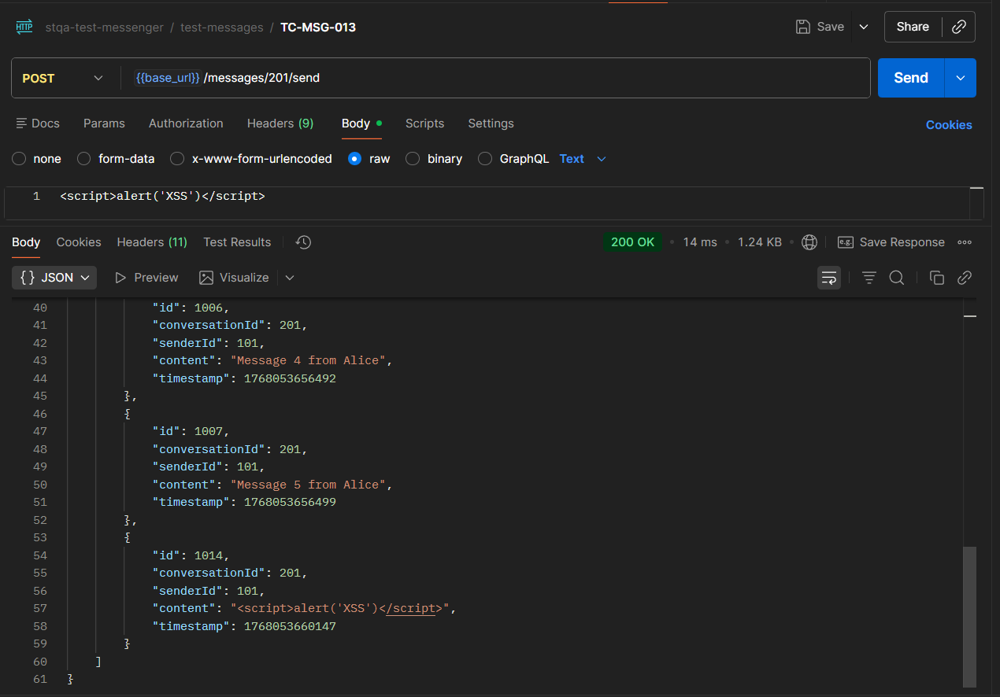

### TC-MSG-014: Send Message with SQL Injection

- **Pre-conditions:** Conversation 201, alice is member
- **Steps:**
  1. POST /messages/201/send
  2. Header: `Authorization: Bearer <alice_token>`, `Content-Type: text/plain`
  3. Body: `'; DROP TABLE messages; --`
- **Expected:** 200 OK (treated as plain text)
- **Actual:** 200 OK, returns `{
  "message": "Message sent successfully",
  "data": [
  {
  "id": 1001,
  "conversationId": 201,
  "senderId": 101,
  "content": "Hello Bob! This is a test message.",
  "timestamp": 1768053656454
  },
  {
  "id": 1002,
  "conversationId": 201,
  "senderId": 102,
  "content": "Hi Alice! Got your message.",
  "timestamp": 1768053656462
  },
  {
  "id": 1003,
  "conversationId": 201,
  "senderId": 101,
  "content": "Message 1 from Alice",
  "timestamp": 1768053656470
  },
  {
  "id": 1004,
  "conversationId": 201,
  "senderId": 101,
  "content": "Message 2 from Alice",
  "timestamp": 1768053656477
  },
  {
  "id": 1005,
  "conversationId": 201,
  "senderId": 101,
  "content": "Message 3 from Alice",
  "timestamp": 1768053656484
  },
  {
  "id": 1006,
  "conversationId": 201,
  "senderId": 101,
  "content": "Message 4 from Alice",
  "timestamp": 1768053656492
  },
  {
  "id": 1007,
  "conversationId": 201,
  "senderId": 101,
  "content": "Message 5 from Alice",
  "timestamp": 1768053656499
  },
  {
  "id": 1014,
  "conversationId": 201,
  "senderId": 101,
  "content": "",
  "timestamp": 1768053660147
  },
  {
  "id": 1015,
  "conversationId": 201,
  "senderId": 101,
  "content": "'; DROP TABLE messages; --",
  "timestamp": 1768053719257
  }
  ]
  }`
- **Evidence:** 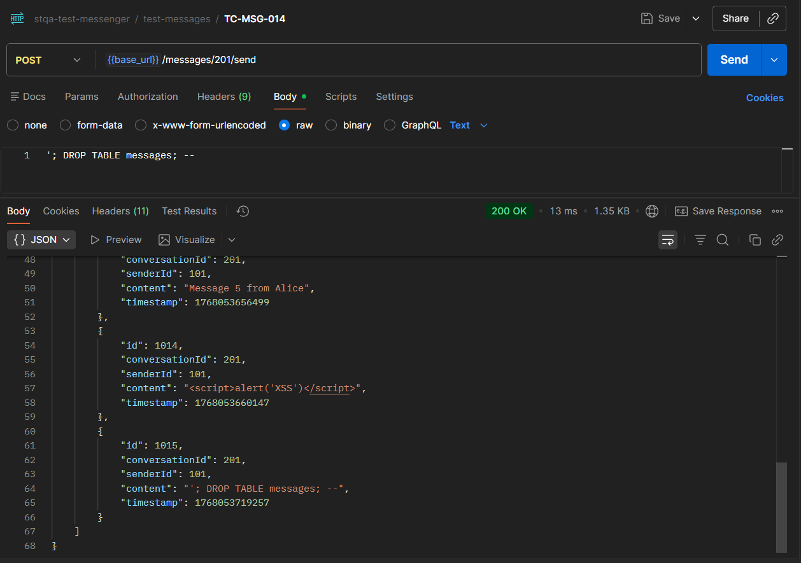

---

